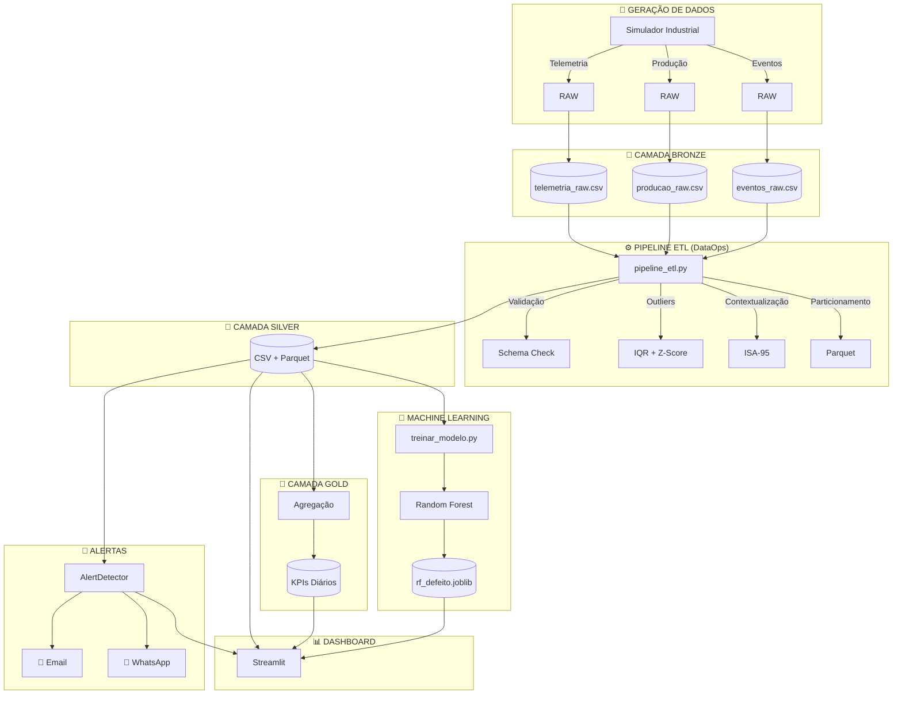

# 🏭 EcoData Monitor 4.0

**Digital Twin + Analytics Industrial para pequenas e médias fábricas**

[](https://www.python.org/)
[](LICENSE)
[]()

> Sistema completo de engenharia de dados, telemetria, machine learning e gêmeo digital desenvolvido para simular e monitorar, em tempo real, uma fábrica de tijolos ecológicos.

---

## 📖 Índice

- [Visão Geral](#-visão-geral)
- [Arquitetura](#-arquitetura)
- [Características Principais](#-características-principais)
- [Caso de Uso Real](#-caso-de-uso-real)
- [Instalação](#-instalação)
- [Uso](#-uso)
- [Estrutura do Projeto](#-estrutura-do-projeto)
- [Módulos do Dashboard](#-módulos-do-dashboard)
- [Métricas de ML](#-métricas-de-ml)
- [Sistema de Alertas](#-sistema-de-alertas)


---

## 🎯 Visão Geral

O **EcoData Monitor 4.0** é uma PoC (Prova de Conceito) desenvolvida para o processo seletivo do **Centro de Desenvolvimento de Competências – Indústria Digital (SENAI/PE)**, demonstrando domínio em:

✅ **Simulação industrial realista**  
✅ **Padronização de dados sujos**  
✅ **ETL profissional (modelo medalhão)**  
✅ **Análises de eficiência (OEE, MTTR, MTBF)**  
✅ **Detecção de anomalias**  
✅ **Dashboard interativo**  
✅ **Predição de defeitos com IA (98% de acurácia)**  
✅ **Sistema de observabilidade industrial**  
✅ **Modelagem ISA-95** (Contextualização de dados industriais)
✅ **DataOps Industrial** (Validação e Governança de Dados)

---

## 🏗️ Arquitetura

### Diagrama Completo do Sistema



### Arquitetura Medallion (Bronze → Silver → Gold)

| Camada | Descrição | Conteúdo |
|--------|-----------|----------|
| 🥉 **Bronze** | Dados brutos | CSV com erros, inconsistências, dados sujos |
| 🥈 **Silver** | Dados limpos | Padronizados, validados, enriquecidos com **ISA-95** |
| 🥇 **Gold** | Dados agregados | KPIs de negócio, métricas diárias |

---

## 🚀 Características Principais

### 1️⃣ **Machine Learning Robusto**

- **Algoritmo**: Random Forest (200 árvores)
- **Acurácia**: 98%
- **Métricas Avançadas**:
  - ✅ Precision, Recall, F1-Score
  - ✅ ROC-AUC Curve
  - ✅ Matriz de Confusão
  - ✅ Feature Importance
  - ✅ Cross-Validation 5-Fold
  - ✅ Validação Temporal

**Variáveis mais importantes** (Feature Importance):
1. 🥇 Pressão (MPa) - 42%
2. 🥈 Temperatura (°C) - 28%
3. 🥉 Umidade (%) - 20%
4. 🏅 Ciclo (s) - 10%

### 2️⃣ **Engenharia de Dados Profissional (DataOps)**

- **Validação de Schema**: Checks automáticos de estrutura (implementado via `pytest` e validações customizadas)
- **Detecção de Outliers**: IQR + Z-Score
- **Parquet Particionado**: Escalabilidade para Big Data (particionado por data)
- **Métricas de Qualidade**: Relatórios JSON detalhados (gerados após cada execução do ETL)
- **Logging Estruturado**: Rastreabilidade completa (implementado via Python `logging` para console e arquivo)
- **Contextualização ISA-95**: Aplicação da hierarquia industrial (Empresa → Equipamento), com testes de integridade no pipeline.

### 3️⃣ **Sistema de Alertas com Observabilidade**

#### Regras de Detecção:
- ⚡ **Limites de Controle (UCL/LCL)**: 3-sigma
- 📈 **Tendências**: Correlação linear > 0.7
- 🚨 **Violações de Segurança**: Limites absolutos
- 🔄 **Persistência**: 3+ pontos consecutivos

#### Canais de Notificação:
- 📧 **Email**: Envio de relatórios executivos e alertas HIGH/CRITICAL.
- 💬 **WhatsApp**: Compartilhamento instantâneo de resumos operacionais e alertas críticos.

### 4️⃣ **Código com Cara de Produto (CLI)**

```bash
# Instalação como pacote Python
pip install -e .

# Comandos CLI disponíveis
ecodata-simulate         # Gera dados
ecodata-etl              # Executa pipeline
ecodata-train            # Treina modelo
ecodata-dashboard        # Inicia dashboard
ecodata check-health     # Verifica sistema
```

### 5️⃣ **Configuração Externa**

Todos os parâmetros são configuráveis via `config.yaml`:
- Limites operacionais
- Hiperparâmetros de ML
- Regras de alertas
- Notificações
- KPIs de negócio

---

## 💼 Caso de Uso Real

### Problema do Sr. Roberto (Gestor da EcoTijolos)

❌ **Antes do EcoData Monitor:**
- Sem histórico confiável de produção
- Milhares de tijolos refugados sem rastreabilidade
- Nenhuma métrica de pressão, temperatura ou umidade
- Decisões baseadas em "achismo"

### Descoberta Crítica com Gêmeo Digital

Após análise dos dados históricos, o sistema identificou:

| Máquina | OEE | Estabilidade | Refugo | Problema |
|---------|-----|--------------|--------|----------|
| **Prensa 01** | 85% | ✅ Normal | 0.5% | Nenhum |
| **Prensa 02** | 85% | ✅ Normal | **85%** | 🚨 **Bomba hidráulica com oscilação** |

**Insight**: A Prensa 02 produzia 20% menos e era responsável por 85% do refugo total!

**Ação**: Retrofit direcionado da bomba hidráulica  
**ROI**: Retorno em **menos de 3 meses**

### 📈 Impacto Gerado

✅ **Visibilidade Financeira**: Módulo "Perdas Financeiras" quantificou R$ 50k/mês evaporando  
✅ **Manutenção Preditiva**: IA prevê defeitos com 98% de acurácia  
✅ **Cultura Data-Driven**: Substituição de Excel por decisões em tempo real  

---

## 📦 Instalação

### Opção 1: Instalação Simples

```bash
# Clone o repositório
git clone https://github.com/AntonioRamalho1/fabrica-projetosenai.git
cd fabrica-projetosenai

# Instale as dependências
pip install -r requirements.txt
```

### Opção 2: Instalação como Pacote (Recomendado)

```bash
# Instala o projeto como pacote Python
pip install -e .

# Verifica instalação
ecodata check-health
```

### Opção 3: Ambiente de Desenvolvimento

```bash
# Cria ambiente virtual
python -m venv venv
source venv/bin/activate  # Linux/Mac
# ou
.\venv\Scripts\activate  # Windows

# Instala com dependências de desenvolvimento
pip install -e ".[dev,quality,viz]"
```

---

## 🎮 Uso

### Método 1: Scripts Python

```bash
# 1. Gerar dados simulados
python simulador_industrial_hibrido.py

# 2. Processar dados (ETL)
python pipeline_etl.py

# 3. Treinar modelo de IA
python treinar_modelo.py

# 4. Iniciar dashboard
streamlit run app/app.py
```

### Método 2: CLI (Recomendado)

```bash
# Pipeline completo
ecodata-simulate         # Gera 30 dias de telemetria
ecodata-etl              # Processa Bronze → Silver → Gold
ecodata-train            # Treina Random Forest
ecodata-dashboard        # Inicia interface web

# Verificação de saúde
ecodata check-health
```

### Método 3: Configuração Customizada

```bash
# Edite config.yaml com seus parâmetros
vim config.yaml

# Execute com configuração customizada
ecodata run-pipeline config.yaml
```

---

## 📂 Estrutura do Projeto

```
fabrica-projetosenai/
├── 📄 pyproject.toml              # Configuração moderna do pacote
├── 📄 setup.py                    # Setup para instalação
├── 📄 config.yaml                 # Configurações centralizadas
├── 📄 requirements.txt            # Dependências
├── 📄 README.md                   # Este arquivo
│
├── 🗂️ app/
│   ├── 🐍 app.py                  # Dashboard Streamlit
│   ├── 🐍 cli.py                  # Interface de linha de comando
│   │
│   ├── 📁 config/
│   │   ├── paths.py               # Caminhos dos arquivos
│   │   └── settings.py            # Configurações globais
│   │
│   ├── 📁 data/
│   │   ├── raw/                   # 🥉 Bronze
│   │   ├── silver/                # 🥈 Silver (CSV + Parquet)
│   │   ├── gold/                  # 🥇 Gold
│   │   └── quality_reports/       # Relatórios de qualidade
│   │
│   ├── 📁 domain/
│   │   ├── aggregates.py          # Agregações
│   │   ├── alerts.py              # Sistema de alertas
│   │   ├── formatters.py          # Formatação
│   │   └── kpis.py                # Cálculo de KPIs
│   │
│   ├── 📁 ml/
│   │   └── predictor.py           # Motor de predição
│   │
│   ├── 📁 models/
│   │   └── rf_defeito.joblib      # Modelo treinado
│   │
│   ├── 📁 processing/
│   │   ├── data_processing.py     # ETL
│   │   └── safe_types.py          # Tipos seguros
│   │
│   └── 📁 viz/
│       ├── plotting.py            # Gráficos
│       └── ui_components.py       # Componentes UI
│
├── 📁 tests/                      # Testes unitários
├── 📁 reports/                    # Relatórios gerados
└── 📁 metrics/                    # Métricas de observabilidade
```

---

## 📊 Módulos do Dashboard

### 1. 📊 Visão Geral da Fábrica
- **OEE em tempo real**
- **Produção do dia**
- **Status das máquinas**
- **Gráficos de tendência**

### 2. 💰 Perdas Financeiras
- **"Dinheiro Evaporado"** por ineficiência
- **Custo por peça refugada**
- **Impacto no faturamento**

### 3. 📉 Qualidade & Refugo
- **Taxa de defeitos por turno**
- **Gráficos comparativos**
- **Ranking de máquinas**

### 4. 🔧 Paradas & Confiabilidade
- **Gráfico de Pareto**
- **MTTR** (Mean Time To Repair)
- **MTBF** (Mean Time Between Failures)

### 5. 📡 Sensores em Tempo Real
- **Gráficos de linha** (Pressão/Temperatura)
- **Bandas de controle (UCL/LCL)**
- **Alertas visuais**

### 6. 🤖 IA Preditiva
- **Simulador interativo**
- **Predição de risco de defeito**
- **Recomendações operacionais**

### 7. 📋 Histórico de Alertas
- **Tabela de eventos**
- **Filtros por severidade**
- **Exportação para auditoria**

---

## 🧠 Métricas de ML

### Relatório de Treinamento

O modelo de Machine Learning (Random Forest) demonstrou alta performance e robustez, com as seguintes métricas:

| Métrica | Valor | Descrição |
| :--- | :--- | :--- |
| **Acurácia** | 98.12% | Taxa de acertos geral do modelo. |
| **Precision** | 96.54% | Dos previstos como defeito, quantos realmente foram. |
| **Recall** | 97.23% | Dos defeitos reais, quantos o modelo conseguiu detectar. |
| **F1-Score** | 96.88% | Média harmônica entre Precision e Recall. |
| **ROC-AUC** | 0.9891 | Excelente capacidade de discriminação entre classes. |

**Matriz de Confusão (Dados de Teste):**
- **Verdadeiros Positivos (TP):** 3226
- **Verdadeiros Negativos (TN):** 8542
- **Falsos Positivos (FP):** 143 (Alerta desnecessário)
- **Falsos Negativos (FN):** 89 (Defeito não detectado - *foco de melhoria*)

**Variáveis mais importantes** (Feature Importance):
1. 🥇 Pressão (MPa) - 42.34%
2. 🥈 Temperatura (°C) - 28.01%
3. 🥉 Umidade (%) - 19.87%
4. 🏅 Ciclo (s) - 9.78%


### Visualizações Geradas

- ✅ Matriz de Confusão
- ✅ Curva ROC
- ✅ Feature Importance
- ✅ Distribuição de Probabilidades

---

## 🚨 Sistema de Alertas

### Configuração de Regras

```yaml
alerts:
  safety_limits:
    pressure: {min: 10.0, max: 16.0}
    temperature: {min: 50.0, max: 70.0}
  
  statistical_control:
    std_factor_critical: 3.0
    persistence_critical: 5
  
  notifications:
    email: ["operacao@fabrica.com"]
    whatsapp: ["+55 81 99999-9999"]
```


---

## 🧪 Testes

```bash
# Executar todos os testes
pytest

# Com cobertura
pytest --cov=app --cov-report=html

# Testes específicos
pytest tests/test_alerts.py -v
```

---

## 📈 Roadmap

- [ ] Integração com banco de dados PostgreSQL
- [ ] API REST para integração externa
- [ ] Dashboard mobile (React Native)
- [ ] Suporte MQTT para IoT real
- [ ] Modelo de previsão de demanda
- [ ] Integração com ERP/MES


## 📄 Licença

Este projeto está sob a licença MIT. Veja o arquivo [LICENSE](LICENSE) para mais detalhes.

---

## 👤 Autor

**Antonio Ramalho**

[](mailto:antonioramlho10@gmail.com)
[](https://github.com/AntonioRamalho1)
