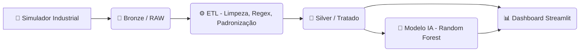

# 🏭 EcoData Monitor 4.0  
> **Digital Twin + Analytics Industrial para pequenas e médias fábricas**


---

# 📖 Visão Geral

O **EcoData Monitor 4.0** é um sistema completo de **engenharia de dados**, **telemetria**, **machine learning** e **gêmeo digital** desenvolvido para simular e monitorar, em tempo real, uma fábrica de **tijolos ecológicos**.

Foi criado como **PoC (Prova de Conceito)** para o processo seletivo do **Centro de Desenvolvimento de Competências – Indústria Digital (SENAI/PE)**, mostrando domínio em:

- Simulação industrial realista  
- Padronização de dados sujos  
- ETL profissional (modelo medalhão)  
- Análises de eficiência  
- Detecção de anomalias  
- Dashboard interativo  
- Predição de defeitos com IA  

---

# 🏭 História: A Fábrica do Sr. Roberto

O projeto modela uma fábrica realista chamada **EcoTijolos**, administrada pelo **Sr. Roberto**, um gestor típico de pequenas indústrias brasileiras.

Problemas enfrentados por ele:

### ❌ 1. Produção anotada em papel  
Não havia histórico confiável.

### ❌ 2. Defeitos só percebidos dias depois  
Milhares de tijolos iam para o lixo sem rastreabilidade.

### ❌ 3. Cada máquina se comportava diferente  
Mas ninguém conseguia provar isso com dados.

### ❌ 4. Falta de telemetria  
Sem pressão, temperatura ou umidade registradas.

---

# 💡 A Solução

Criamos um **gêmeo digital completo** da fábrica, ligando:

### ✔ Simulador industrial  
Gera dados realistas, horários e segundo a segundo.

### ✔ ETL completo (Bronze → Silver → Gold)  
Limpeza, padronização e enriquecimento.

### ✔ Dashboard Streamlit  
Com análises de Produção, Qualidade, Telemetria e IA.

### ✔ IA preditiva Random Forest  
Modelo capaz de prever defeitos antes de ocorrerem.

---

# 🏭 🔧 Diferença entre as Máquinas  
## **(Parte nova incluída no README)**

Para tornar o projeto mais realista — e mais útil para o Sr. Roberto — remodelamos a simulação para representar duas máquinas bem diferentes:

---

# ⚙️ Perfil das Máquinas

## 🟩 **Máquina 1 — “A Nova”**
- Alta eficiência  
- Menos variação de temperatura  
- Raramente quebra  
- Baixa taxa de refugo  
- Produção próxima do limite teórico  

## 🟥 **Máquina 2 — “A Velha”**
- 15%–30% menos produtiva  
- Quebra com mais frequência  
- Alta oscilação térmica  
- Gera mais refugos  
- Consome mais energia para a mesma produção  
- Tende a operar fora da faixa ideal  

---

# 🤖 Por que isso é importante?

Porque isso **cria um cenário de análise real**, onde:

### • A Máquina 1 sempre aparece “melhor” nos gráficos  
→ O gestor entende imediatamente a necessidade de manutenção da Máquina 2.

### • O ETL precisa padronizar dados sujos e inconsistentes  
→ Exatamente como ocorre no mundo real.

### • O modelo de IA vê comportamentos diferentes  
→ A previsão se torna muito mais robusta.

### • O Dashboard mostra insights de verdade  
→ Diferença de produção  
→ Diferença de consumo  
→ Diferença de refugo  

---

# 🔥 Impacto dessa mudança no projeto

### ✔ Dashboards muito mais interessantes  
As linhas de produção finalmente **não ficam iguais**.

### ✔ Análises reais de OEE e perdas  
A máquina 2 naturalmente gera:

- mais paradas  
- mais refugos  
- mais consumo por peça  
- mais instabilidade térmica  

### ✔ Storytelling perfeito para o TCC e apresentação  
O Sr. Roberto rapidamente entende:

> “A máquina 2 está me fazendo perder dinheiro.”

---

# 📊 Arquitetura Técnica

O projeto segue o padrão **Medallion Architecture** (Bronze → Silver → Gold), muito usado em data lakes modernos:



---

# 🔍 Dados Simulados

O simulador industrial gera três tipos de arquivos:

### 🟫 **Bronze (dados brutos)**
- Telemetria suja  
- Eventos com erros  
- Anomalias intencionais  
- Temperaturas com nomes diferentes:  
  - `temp_matriz_c`  
  - `temperatura`  
  - `temp`  
  - `C` (apenas "C"!)  

### ⚙️ **Silver (dados limpos via ETL)**
- Padronização  
- Tipagem  
- Correção por Regex  
- Inputação de falhas  
- Alinhamento de máquinas e turnos  

### 🧠 **Modelo IA (Gold Layer)**
- Classificação de defeito baseado em:
  - pressão  
  - umidade  
  - temperatura  
  - ciclo  

---

# 🖥️ Dashboard: Módulos

O painel possui **7 abas principais**:

| Aba | Função |
|------|-------|
| **Visão Geral** | KPIs, produção por máquina e turnos |
| **Lucro** | Mostra dinheiro perdido por refugos e ineficiência |
| **Qualidade** | Análises de defeito, correlação e probabilidades |
| **Manutenção** | Pareto de causas e histórico |
| **Telemetria** | Pressão, temperatura e umidade em tempo real |
| **Simulador IA** | Predição do risco de defeito |
| **Eventos** | Auditoria completa de alarmes e paradas |

---

# 🧪 Como Rodar o Projeto

## 1. Clone o repositório
```bash
git clone https://github.com/SEU_USUARIO/SEU_REPO.git
cd SEU_REPO
```

## 2. Crie o ambiente
```bash
python -m venv venv
.\venv\Scripts\activate
```

## 3. Instale dependências
```bash
pip install -r requirements.txt
```

## 4. Gere os dados e treine o modelo
```bash
python simulador_industrial_hibrido.py
# Execute processamento_2.ipynb
python treinar_modelo_v2.py
```

## 5. Inicie o Dashboard
```bash
streamlit run app/app.py
```

---

# 📂 Estrutura do Projeto

```
PROJETOSENAI/
├── app/
│   ├── config/
│   │   ├── __init__.py
│   │   ├── paths.py
│   │   └── settings.py
│   ├── data/
│   │   ├── gold/
│   │   │   └── kpis_daily_gold.csv
│   │   ├── raw/
│   │   │   ├── eventos_industriais.csv
│   │   │   ├── eventos_raw.csv
│   │   │   ├── historico_producao_1ano.csv
│   │   │   ├── producao_raw.csv
│   │   │   ├── telemetria_detalhada_30dias.csv
│   │   │   ├── telemetria_raw.csv
│   │   │   └── uns_tags.json
│   │   ├── silver/
│   │   │   ├── eventos_silver.csv
│   │   │   ├── producao_silver.csv
│   │   │   └── telemetria_silver.csv
│   │   └── data_dictionary.md
│   ├── domain/
│   │   ├── __init__.py
│   │   ├── aggregates.py
│   │   ├── alerts.py
│   │   ├── formatters.py
│   │   └── kpis.py
│   ├── ml/
│   │   ├── __init__.py
│   │   └── predictor.py
│   ├── models/
│   │   └── rf_defeito.joblib
│   ├── processing/
│   │   ├── __init__.py
│   │   ├── data_processing.py
│   │   └── safe_types.py
│   ├── viz/
│   │   ├── __init__.py
│   │   ├── plotting.py
│   │   └── ui_components.py
│   ├── __init__.py
│   └── app.py
├── tests/
│   ├── __init__.py
│   ├── test_aggregates.py
│   ├── test_alerts.py
│   ├── test_data_loader.py
│   └── test_data_quality.py
├── venv/
├── .gitignore
├── __init__.py
├── pipeline_etl.py
├── processamento_2.ipynb
├── README.md
├── requirements.txt
├── simulador_industrial_hibrido.py
├── treinar_modelo.py
└── verificar_diferenca.py
```

---

# 👤 Autor

**Antonio Cazé Ramalho**  
Desenvolvido como PoC para o **SENAI/PE – Indústria Digital**  
Focado em impacto real, engenharia de dados e automação industrial.

---

`Desenvolvido em Novembro de 2025.`  