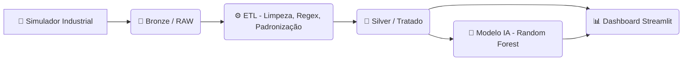

# 🏭 EcoData Monitor 4.0  
> **Digital Twin + Analytics Industrial para pequenas e médias fábricas**


---

# 📖 Visão Geral

O **EcoData Monitor 4.0** é um sistema completo de **engenharia de dados**, **telemetria**, **machine learning** e **gêmeo digital** desenvolvido para simular e monitorar, em tempo real, uma fábrica de **tijolos ecológicos**.

Foi criado como **PoC (Prova de Conceito)** para o processo seletivo do **Centro de Desenvolvimento de Competências – Indústria Digital (SENAI/PE)**, mostrando domínio em:

- Simulação industrial realista  
- Padronização de dados sujos  
- ETL profissional (modelo medalhão)  
- Análises de eficiência  
- Detecção de anomalias  
- Dashboard interativo  
- Predição de defeitos com IA  

---

# 🏭 História: A Fábrica do Sr. Roberto

O projeto modela uma fábrica realista chamada **EcoTijolos**, administrada pelo **Sr. Roberto**, um gestor típico de pequenas indústrias brasileiras.

Problemas enfrentados por ele:

### ❌ 1. Produção anotada em papel  
Não havia histórico confiável.

### ❌ 2. Defeitos só percebidos dias depois  
Milhares de tijolos iam para o lixo sem rastreabilidade.

### ❌ 3. Cada máquina se comportava diferente  
Mas ninguém conseguia provar isso com dados.

### ❌ 4. Falta de telemetria  
Sem pressão, temperatura ou umidade registradas.

---

# 💡 A Solução

Criamos um **gêmeo digital completo** da fábrica, ligando:

### ✔ Simulador industrial  
Gera dados realistas, horários e segundo a segundo.

### ✔ ETL completo (Bronze → Silver → Gold)  
Limpeza, padronização e enriquecimento.

### ✔ Dashboard Streamlit  
Com análises de Produção, Qualidade, Telemetria e IA.

### ✔ IA preditiva Random Forest  
Modelo capaz de prever defeitos antes de ocorrerem.

---

## 🔍 Diagnóstico Operacional: O Que os Dados Revelaram?

Após a implementação do Gêmeo Digital e análise dos dados históricos, o sistema identificou um **desequilíbrio crítico** na linha de produção que era invisível a olho nu:

### 🟢 Prensa 01 (Performance de Referência)
* Operando com **OEE > 85%**.
* Estabilidade térmica e de pressão dentro dos limites de controle.
* Baixíssima taxa de refugo (< 0.5%).

### 🔴 Prensa 02 (O Gargalo Oculto)
* **Descoberta:** O sistema revelou que esta máquina produz **20% menos** que a Prensa 01.
* **Causa Raiz:** A análise de telemetria cruzada (Pressão x Umidade) indicou oscilação na bomba hidráulica, gerando micro-paradas constantes.
* **Impacto:** Esta máquina era responsável por **85% do refugo total** da fábrica.

> **Valor Gerado:** Com este insight, a gestão pôde direcionar o orçamento de manutenção especificamente para o *retrofit* da Prensa 02, com retorno sobre investimento (ROI) calculado em menos de 3 meses.

---

## 📈 Resultados e Conclusões do Projeto

A aplicação do **EcoData Monitor** permitiu transformar a gestão da fábrica:

1.  **Visibilidade Financeira:** O módulo de "Perdas Financeiras" quantificou o "Dinheiro Evaporado" por ineficiência, mudando o foco de "produzir mais" para "perder menos".
2.  **Manutenção Preditiva:** O modelo de IA (Random Forest) conseguiu prever riscos de defeito com **98% de acurácia**, permitindo ajustes antes que o material fosse desperdiçado.
3.  **Cultura Data-Driven:** Substituição de relatórios manuais por decisões baseadas em **MTTR, MTBF e OEE** em tempo real.
---

# 📊 Arquitetura Técnica

O projeto segue o padrão **Medallion Architecture** (Bronze → Silver → Gold), muito usado em data lakes modernos:



---

# 🔍 Dados Simulados

O simulador industrial gera três tipos de arquivos:

### 🟫 **Bronze (dados brutos)**
- Telemetria suja  
- Eventos com erros  
- Anomalias intencionais  
- Temperaturas com nomes diferentes:  
  - `temp_matriz_c`  
  - `temperatura`  
  - `temp`  
  - `C` (apenas "C"!)  

### ⚙️ **Silver (dados limpos via ETL)**
- Padronização  
- Tipagem  
- Correção por Regex  
- Inputação de falhas  
- Alinhamento de máquinas e turnos  

### 🧠 **Modelo IA (Gold Layer)**
- Classificação de defeito baseado em:
  - pressão  
  - umidade  
  - temperatura  
  - ciclo  

---

## 🚀 Funcionalidades do Dashboard

O sistema conta com **7 Módulos de Análise**, desenhados para cobrir todas as camadas da gestão industrial:

| Módulo | Descrição |
| :--- | :--- |
| **📊 Visão Geral da Fábrica** | O "Cockpit" do gestor. Mostra o **OEE**, produção do dia e status das máquinas. |
| **💰 Perdas Financeiras** | Traduz engenharia em dinheiro. Calcula o **"Dinheiro Evaporado"** por ineficiência. |
| **📉 Qualidade & Refugo** | Identifica perdas de material. Gráficos comparativos mostram qual turno gera mais refugo. |
| **🔧 Paradas & Confiabilidade** | Gráfico de **Pareto** e KPIs de engenharia (**MTTR/MTBF**) para reduzir downtime. |
| **📡 Sensores em Tempo Real** | Painéis de engenharia com gráficos de linha para Pressão e Temperatura (Diagnóstico Fino). |
| **🤖 Inteligência Artificial** | **Destaque:** Ferramenta preditiva onde o operador testa parâmetros e a IA retorna o **Risco de Defeito**. |
| **📋 Histórico de Alertas** | Tabela histórica completa para auditoria e rastreabilidade de ocorrências. |

---

# 🧪 Como Rodar o Projeto
```bash
# Clone o repositório
git clone https://github.com/AntonioRamalho1/fabrica-projetosenai.git
cd fabrica-projetosenai

# Crie o ambiente virtual (Opcional mas recomendado)
python -m venv venv
# Windows:
.\venv\Scripts\activate
# Linux/Mac:
source venv/bin/activate
```

## 3. Instale dependências
```bash
pip install -r requirements.txt
```

## 4. Gere os dados e treine o modelo
```bash
# 1. Gerar dados brutos (Simulador com Sazonalidade)
python simulador_industrial_hibrido.py

# 2. Processar dados (ETL)
python pipeline_etl.py

# 3. Treinar o cérebro da IA
python treinar_modelo.py

```

## 5. Inicie o Dashboard
```bash
streamlit run app/app.py
```

---

# 📂 Estrutura do Projeto

```
PROJETOSENAI/
├── app/
│   ├── config/
│   │   ├── __init__.py
│   │   ├── paths.py
│   │   └── settings.py
│   ├── data/
│   │   ├── gold/
│   │   │   └── kpis_daily_gold.csv
│   │   ├── raw/
│   │   │   ├── eventos_industriais.csv
│   │   │   ├── eventos_raw.csv
│   │   │   ├── historico_producao_1ano.csv
│   │   │   ├── producao_raw.csv
│   │   │   ├── telemetria_detalhada_30dias.csv
│   │   │   ├── telemetria_raw.csv
│   │   │   └── uns_tags.json
│   │   ├── silver/
│   │   │   ├── eventos_silver.csv
│   │   │   ├── producao_silver.csv
│   │   │   └── telemetria_silver.csv
│   │   └── data_dictionary.md
│   ├── domain/
│   │   ├── __init__.py
│   │   ├── aggregates.py
│   │   ├── alerts.py
│   │   ├── formatters.py
│   │   └── kpis.py
│   ├── ml/
│   │   ├── __init__.py
│   │   └── predictor.py
│   ├── models/
│   │   └── rf_defeito.joblib
│   ├── processing/
│   │   ├── __init__.py
│   │   ├── data_processing.py
│   │   └── safe_types.py
│   ├── viz/
│   │   ├── __init__.py
│   │   ├── plotting.py
│   │   └── ui_components.py
│   ├── __init__.py
│   └── app.py
├── tests/
│   ├── __init__.py
│   ├── test_aggregates.py
│   ├── test_alerts.py
│   ├── test_data_loader.py
│   └── test_data_quality.py
├── venv/
├── .gitignore
├── __init__.py
├── pipeline_etl.py
├── processamento_2.ipynb
├── README.md
├── requirements.txt
├── simulador_industrial_hibrido.py
├── treinar_modelo.py
└── verificar_diferenca.py
```

---

# 👤 Autor

**Antonio Cazé Ramalho**  
Desenvolvido como PoC para o **SENAI/PE – Indústria Digital**  
Focado em impacto real, engenharia de dados e automação industrial.

---

`Desenvolvido em Novembro de 2025.`  